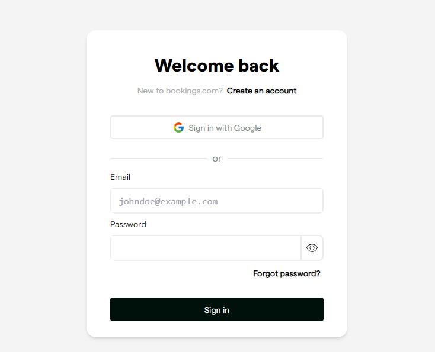

# Appointment Booking Login v1.0

The Login Page of an appointment booking platform.
## Table of contents

- [Overview](#overview)
  - [The challenge](#the-challenge)
  - [Screenshot](#screenshot)
  - [Links](#links)
- [My process](#my-process)
  - [Built with](#built-with)
  - [What I learned](#what-i-learned)
  - [Continued development](#continued-development)
  - [Useful resources](#useful-resources)
- [Author](#author)
- [Acknowledgments](#acknowledgments)


## Overview
UI for user registration.
### The challenge

Users should be able to:

- Sign in with errors detected.
- See hover and focus states for all interactive elements on the page


### Screenshot



### Links

- Solution URL: [Github Link](https://github.com/Asiedu13/appointment-booking)
- Live Site URL: [Appointment Booking UI](https://appointment-booking-hazel.vercel.app/)

## My process
### Selecting the Tools / Technologies
I used Next.js because of the extra features Next.js gives to a React application and it was a requirement.


### Planning the Layouts
Using a design on Figma, I planned the elements to group together and the ones that would be standalone as well as the how the project files would be structured for easier interaction.
### Building the Views 
I then wrote code for everything planned and still planning
### Built with

- Next.js
- Tailwindcss
- Flexbox
- Mobile-first workflow

### What I learned

This project helped me apply the various features of Next. From file based routing to all the optimizations Next undertakes to keep the application fast at all levels.

This project also allowed me to
- implement tailwindcss in a Next app
- Diligently follow a FIGMA UI under supervision.


```html
 <section className="w-[fit-content] h-1/2">
              <section className='py-4'>
                <h1 className='text-7xl font-bold pb-5 '> {city}, {country_code}</h1>
                <p> {today}</p>
                </section>
 <section />
```


### Continued development
Further on in this project, I would like to
- Integrate with an API to authenticate users
- Enable toggle visibility of password field.
- Improve mobile responsiveness
- Include transitions for a better experience
### Useful resources

- [Tailwind official docs](https://tailwindcss.com/docs/installation) - This helped me with using tailwindcss for the project. I really liked the simplicity and the ctrl + K shortcut for searching.

- [Next.js](https://nextjs.org/) project bootstrapped with [`create-next-app`](https://github.com/vercel/next.js/tree/canary/packages/create-next-app).

- [Successful Git Model](https://nvie.com/posts/a-successful-git-branching-model/)

**However, I am open to alternatives so reach out to me if you have any.**


## Author

- Website - [Asiedu Prince Kofi](https://Asiedu13.github.io)
- Github - [@Asiedu13](https://github.com/Asiedu13)
- Twitter - [@Prince_KAsiedu](https://www.twitter.com/Prince_KAsiedu)

## Acknowledgments


### APIs Used
None yet